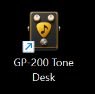
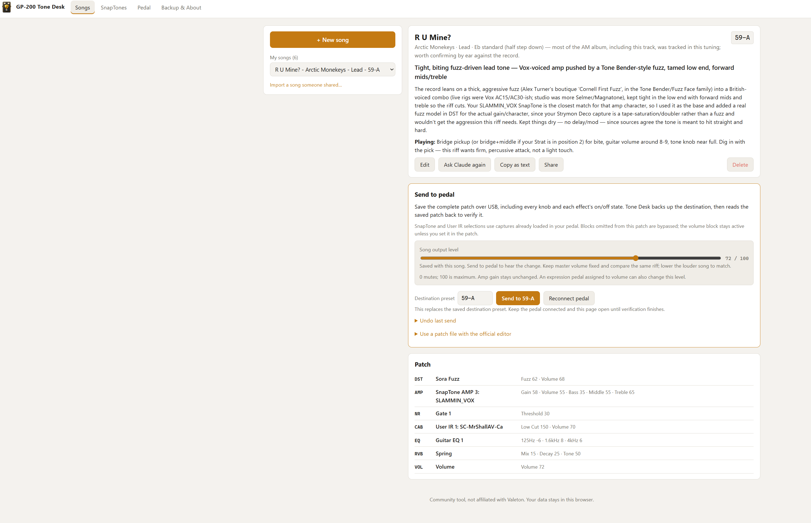
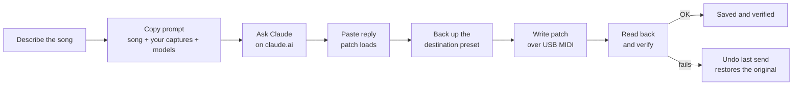
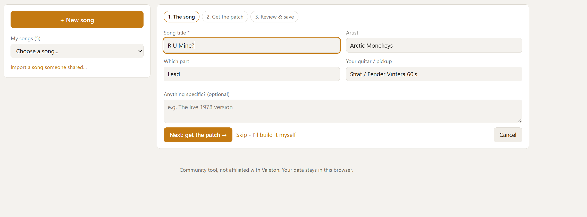
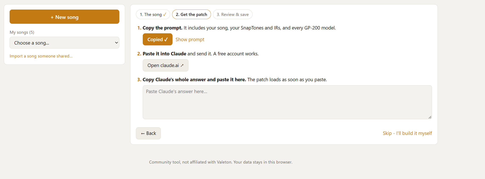
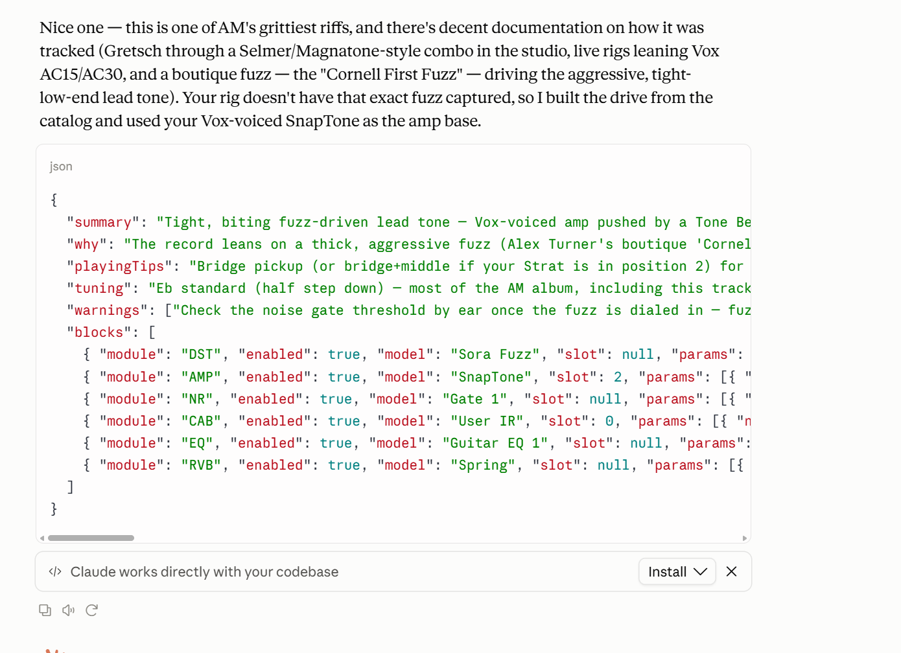

  

<h1 align="center">GP-200 Tone Desk</h1>

  <b>Plan a song's tone with Claude, then send the full patch to your Valeton GP-200 over USB.</b> 
  Free · runs in your browser · no account · nothing uploaded

  <a href="https://github.com/Kaprrrr/GP-200-Tone-Desk/releases/latest/download/GP-200_Tone_Desk_v1.2.5_Windows.zip"><b>Download for Windows</b></a>
  &nbsp;·&nbsp;
  <a href="https://github.com/Kaprrrr/GP-200-Tone-Desk/releases/latest/download/GP-200_Tone_Desk_v1.2.6_Mac.zip"><b>Download for Mac</b></a>
  &nbsp;·&nbsp;
  <a href="https://github.com/Kaprrrr/GP-200-Tone-Desk/releases">All releases</a>

GP-200 Tone Desk is a free community tool for the Valeton GP-200 multi-effects pedal. Describe a song, and Claude suggests a patch built from **your own** SnapTone (NAM) captures, User IRs and the pedal's built-in models. Tone Desk then writes that patch to the pedal over USB and reads it back to make sure it saved correctly.

> Not affiliated with or endorsed by Valeton or Hotone.

## Features

| Tab | What you do there |
| --- | --- |
| **Songs** | Create a song (title, artist, part, guitar and pickup, notes), get a patch from Claude or build it yourself, then send it to a preset slot. Edit, ask Claude again, copy as text, share or delete. |
| **SnapTones** | Keep a library of the captures and User IRs loaded in each slot: what each one really is, where it came from, and the knob settings that suit it. |
| **Pedal** | Connect to the GP-200 over USB MIDI. Capture and IR slots are read automatically. |
| **Backup & About** | Export or restore a backup of your songs and library, and check the installed version. |

- **Free patch suggestions from Claude.** "Copy prompt" builds a prompt with your song, your SnapTones and IRs, and every GP-200 model. Paste it into [claude.ai](https://claude.ai) (a free account works), then paste the reply back. The patch loads as soon as you paste.
- **Safe sends.** Every send backs up the destination preset, writes the complete patch (every knob and on/off state), then reads it back to verify. **Undo last send** restores the original, and you can download it as a `.prst` file.
- **Song volume balancing.** A per-song output slider (0 to 100) on the final VOL block, for matching levels between songs by ear.
- **Sharing.** Export a song as a file and import songs other players share.
- **Official editor fallback.** Export a patch file to use with Valeton's own editor.
- **Jump to preset.** One click selects the preset a song is saved in.

## How it works

Tone Desk is a single web page that talks to the pedal through your browser's Web MIDI support. Your songs, capture library and undo backup are stored in that browser on your computer. Nothing leaves your machine except the prompt you paste into Claude yourself.

| 1. Describe the song | 2. Get the patch from Claude |
| --- | --- |
|  |  |

What Claude's reply looks like

## Getting started

**You need:** a GP-200 (tested on firmware 1.8), a USB cable, and **Chrome or Edge**. Safari, iPhone and iPad can't talk to USB MIDI devices.

1. Download the ZIP for your computer from [Releases](https://github.com/Kaprrrr/GP-200-Tone-Desk/releases) and unzip it anywhere (Desktop, Documents...).
2. Plug in the GP-200 with USB and **close the official GP-200 editor**. Only one program can talk to the pedal at a time.
3. Open Tone Desk:
   - **Windows:** double-click `GP-200 Tone Desk.exe` (the pedal icon). It opens Edge, or Chrome if Edge isn't installed.
   - **Mac:** Control-click `GP-200 Tone Desk.html` and choose **Open With > Google Chrome** or **Microsoft Edge**. Once either is the file's default browser, double-click to open it.
4. Go to the **Pedal** tab and click **Connect to GP-200**. When the browser asks for MIDI access, click **Allow**.
5. Fill in your captures on the **SnapTones** tab, then add songs on the **Songs** tab.
6. Pick a song, choose the destination preset under **Send to pedal**, click **Send** and confirm. Keep the pedal connected until **Saved and verified** appears. You don't need to press SAVE on the pedal.

> **First launch on Windows:** the launcher isn't signed with a paid publisher certificate, so Windows may show an unknown-publisher warning.

## Downloads

| Platform | Version | File | What's inside |
| --- | --- | --- | --- |
| Windows | 1.2.5 | [GP-200_Tone_Desk_v1.2.5_Windows.zip](https://github.com/Kaprrrr/GP-200-Tone-Desk/releases/latest/download/GP-200_Tone_Desk_v1.2.5_Windows.zip) | `GP-200 Tone Desk.exe` launcher with the pedal icon, plus `READ ME FIRST.txt` |
| Mac | 1.2.6 | [GP-200_Tone_Desk_v1.2.6_Mac.zip](https://github.com/Kaprrrr/GP-200-Tone-Desk/releases/latest/download/GP-200_Tone_Desk_v1.2.6_Mac.zip) | `GP-200 Tone Desk.html`, the whole app in one page, plus `READ ME FIRST.txt` |

Both versions use the same patch encoder, unchanged since 1.2.4.

## Your data

Everything is saved in your browser on this computer: no account, no server, nothing uploaded. Use **Backup & About > Export backup** now and then, especially before clearing browser data, switching browsers or moving to a new computer. On Mac, keep the HTML file in the same place and use the same browser so it finds your saved data.

## Important: upgrading from 1.2.3 or earlier

Earlier versions used the editor's display positions instead of stored parameter IDs for some models. This could swap delay time and feedback and cause loud noise. **Version 1.2.4 fixed these mappings**, and the fix passed an offline audit of all 322 model entries and 1,400 parameters. That doesn't mean every effect has been tested by listening.

- Stop using the old release for sends or patch-file exports.
- Your songs are still usable. Resend affected songs from this version to repair the presets saved on your pedal. Updating the app alone doesn't change the pedal.
- Before resending, download any original preset you want to keep from **Undo last send**, because the next send replaces that backup.
- Check repaired presets at low master volume.

## Known limitations

- **Mac transfers** with the corrected encoder still need testing on a real Mac. Windows transfers have been tested.
- **Tempo sync** isn't supported in generated patches yet. Keep Sync switches off and set delay times in milliseconds. Songs with Sync on are rejected before sending.
- **One undo backup.** Only the preset from your latest send is kept. Download it as `.prst` to keep it longer.
- **Captures must already be on the pedal.** SnapTone and User IR choices point at slots already loaded. Tone Desk doesn't upload captures.
- **Levels are matched by ear.** The output slider doesn't measure loudness.

If a transfer stops responding

- Tone Desk reconnects automatically once after repeated incomplete reads, and retries the read without repeating a write.
- If the backup can't finish, nothing is written. If verification can't finish, the preset may have changed, and the previous one is still under **Undo last send**.
- Click **Reconnect pedal** on the song page before retrying. Keep other Tone Desk tabs and the official editor disconnected.
- If the pedal still doesn't answer: unplug USB, power-cycle the pedal, reconnect USB, then click **Reconnect pedal**.

## Credits

- The GP-200's USB MIDI messages were documented by the [phash/gp200editor](https://github.com/phash/gp200editor) project. Thank you!
- SnapTone notes (knob ranges, EQ frequencies) come from the community **GP200 Missing Manual**.

---

Free to use under the [MIT License](LICENSE). Not affiliated with or endorsed by Valeton or Hotone.
